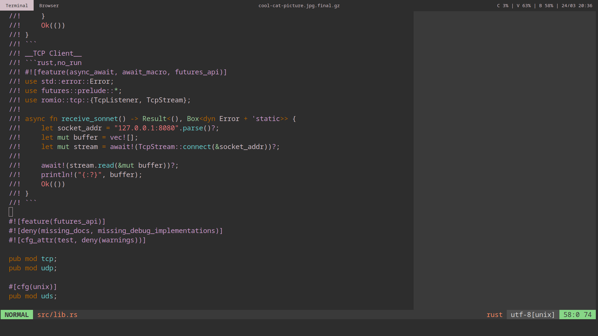

+++
title = "DSLs II: Challenges"
date = 2019-03-03
+++

_This post is part of a series:_

- [_DSLs I: Introduction_](/dsls-1)
- _DSLs II: Challenges (current)_

---

In the last post we examined some examples of DSLs in Rust, and established that
using DSLs in Rust is not uncommon.

In this post we'll look at some of the requirements there exist around DSLs.

_Note: While I might be drawing on challenges from existing technologies, I would like to take a
moment to emphasize that I have the utmost respect and admiration for these technologies, and the
people that have created them. They continue to play a crucial role in pushing the boundaries of
what's possible, and without them we couldn't be having this conversation. This piece exists solely
to enumerate trends, and look towards the future of potential ways we can improve the state of DSLs
in Rust._

## Compile-time Compilation
When building [nanohtml](https://github.com/choojs/nanohtml) we found that we needed to target
Node.js and browsers differently. For browsers we wanted to create real DOM nodes to perform DOM
diffing, but when targeting Node.js all we needed was to concatenate strings.

In addition we wanted to cut down on the code size and startup time in the browser. So instead of
shipping an HTML parsers / interpreter in the final output, we decided to perform the optimization
step ahead of time, and just ship the necessary glue code + resulting code.

We found this ended up cutting down our resulting output size by about 90% for smaller programs, and
reduced our startup time by about 4x. Not to speak of improved runtime performance and user
experience by not having to worry about continuously needing to re-compile the code when switching
between views, making performance less of a concern throughout.

However a downside of doing this in JavaScript was that it was never really built to be compiled.
Every compilation step required significant work to harden and optimize, and even then the resulting
output wasn't even close to Rust's compiler output. By comparison Rust's macro system is like day
and night.

The story of `nanohtml` is only an example. In practice these techniques have been applied this to
other areas too (CSS, assets, GLSL), and found comparable improvements. The takeaway here for DSLs
in Rust would be:

> During compilation DSLs should have the option to be compiled for target platforms.

## Interpolation
The use of having DSLs reside inside program source, rather than in separate files, is so it's
possible to directly plug variables into the DSL. For example if we wanted to create a list of
fishes from a variable, we could quickly use an inline `map` statement:

```js
let html = require('nanohtml')
let fishes = ['bass', 'carp', 'trout']

let doc = html`
  <ul>
    ${fishes.map(fish => html`<li>${fish}</li>`)}
  </ul>
`
```

Compare that to, say, handlebars syntax in Rust:

__fishes.hbs__
```html
<ul>
  
    <li>{{fish}}</li>
  
</ul>
```

__fishes.rs__
```rust
let fishes: Vec<String> = ["bass", "carp", "trout"];
let vals = json!({"fishes": fishes});
let doc = reg.render_template(includ_str!("fishes.hbs"), vals);
```

The handlebars version is spread out over multiple files, defines new operators for control flow,
and has a fair bit of indirection in what's going on. Also in the Rust version, the `json!()` macro
defines a second mode of variable interpolation which is different from the HTML interpolation.

These different syntaxes for interpolation can make learning how to use a particular DSL a bit
tricky. Some of Rust's DSLs use `#var_name`, others use `{var}`, yet again others seem to just pick
up on the environment's variables and interpolate them if they overlap (which is kind of what the
`json!()` macro seems to do.)

The takeaway here would be:

> DSLs benefit from being able to interpolate variables, and from consistency in interpolation
> syntax.

## Escaping
A big constraint Rust's DSLs currently have is that they use [proc
macros](https://doc.rust-lang.org/proc_macro/index.html), and inherit the limitations that proc
macros impose. Most notably the fact that every token inside the macro needs to be valid Rust. Which
includes the requirement that for example braces need to match up, strings closed, and more. E.g.
any DSL made in this way essentially can only exist in the subset of valid Rust tokens.

This limitation might be fine for some simpler DSLs. But when trying to inline other languages
directly, this can be problematic. For example this problem has been evident in `typed-html`, where
not all of HTML can be expressed, and workarounds in the syntax have been implemented. This is
not ideal because it means that we're introducing a library-specific learning curve even for people
that already fluent in HTML. In essence we're no longer implementing our target DSL, but a
_dialect_.

```rust
use typed_html::{html, dom::DOMTree};

// It'd be nice if we didn't have to quote the  tag here.
let doc: DOMTree<String> = html!{
    <p>
        ""
    </p>
};
let doc_str = doc.to_string();
```

There are varying degrees of workarounds that can be employed here, but the takeaway is:

> Relying on Rust token streams as the base building block for the DSL means not all DSLs can be
> expressed.

## Tooling
Something that feels quite undervalued for DSLs is the ability to integrate with tooling. A clear
example of this in Rust is the doc comments DSL, which editors can syntax highlight, and formatters
can auto-format (or so I hope they will be, in the future).



Doc comments in Rust are special because they're built directly into the language.
But in JavaScript there are quite a few DSLs that have tooling integration through the use of the
language-standard [tagged template
literals](https://developer.mozilla.org/en-US/docs/Web/JavaScript/Reference/Template_literals#Tagged_templates).

These act as a clear DSL-bound for the language, where it usually starts with a declaration of which
DSL is about to follow, and continues with the DSL body. We've seen it before in the HTML
example. But it works for other languages too!

```js
// For C
let style = css`
  .button { color: black }
`

let query = sql`
    DROP TABLE piano;
`
```
